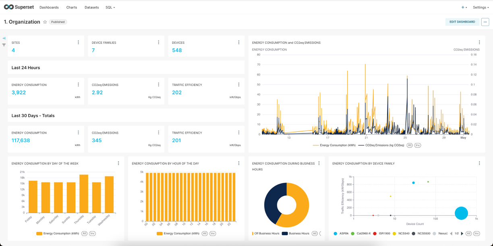
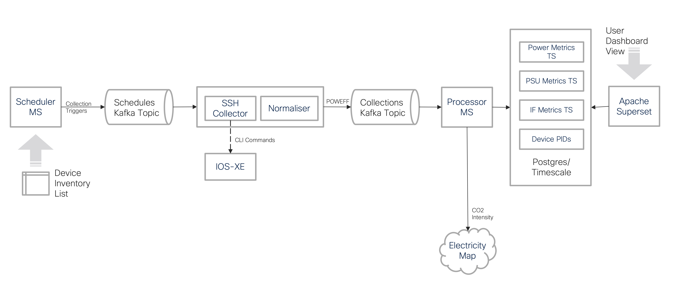

# Sustainability Insights

This package contains Cisco Sustainability Insights tooling. This collects near-real-time power, energy efficiency other metrics from devices to generate visualisation and insights. This is a reference implementation of [POWEFF specification](https://datatracker.ietf.org/doc/draft-opsawg-poweff/) as the normalised data model for power metrics.

This version supports two Cisco devices families viz. Cisco ASR 1000 and Cisco Catalyst 9300 and one connection type viz SSH/CLI. This can be  easily extended to other vendors' device types and other connection types e.g. REST, RESTCONF, SNMP etc.

## Prerequisites

[Docker v24](https://docs.docker.com/get-docker/) OR [Podman v5.x](https://podman.io/get-started)
If using podman, update the build and running scipts to use `podman`, `podman-compose` in place of `docker` and `docker-compose` respectively.

## Quickstart

- [Configure device inventory and collection](./docs/device-configuration.md)
- For Linux users: run `$ chmod 666 config.yaml` as read-write permission is required
- [Configure micro services](./docs/service-configuration.md)
- For Windows users: Edit the shell environment substitues in the `docker-compose.yaml` file. Refer to the `.env` file for default values
- For Windows users: Change the EOL Sequence from CRLF to LF for the following files:
  1. `dbscripts/dbcreate.sh`
  2. `superset/superset-init.sh`
- Start applciations `$ start-susi.sh` or simply `$ docker compose up -d`. Building the docker images is already integreated into the Docker Compose process.
- Open [Application Dashboard](https://locahost:8088) in a browser
- Login with default credential `admin/5cS9Fb73CUnd`
- Select top level, site level or device level dashboard for visualisation and insights
- To stop applciations `$ stop-susi.sh` or simply `$ docker compose down`

## Design

This solution uses below microservices communicating over Apache Kafka messaging infrastructure.

- Scheduler MS
  - Reads device inventory configuration and validates against schema
  - Initiates collection for each device at configured intervals
- SSH Collector MS
  - Initiates connection to the network device using [Cisco pyATS](https://developer.cisco.com/docs/pyats/)
  - Runs platform specific CLI commands
  - Parses CLI command output and normlises to POWEFF data model
- Processor MS
  - Processes POWEFF data
  - Fetches  CO2 Intensity (realtime if Electricity Maps API is configured or uses configured default)
  - Calculates CO2eq emissions and other metrics
  - Stores collected and calculated metrics in [Timescale](https://www.timescale.com) database
- Apache Superset
  - Renders dashboards for metrics visualisation and insights

